# Payment app

The objective of this project is to provide a solution for a payment application. The main functionalities of the application are to:

- **Show card transaction history**: Retrieve and display the payment history associated with a card.
- **Add a new payment**: Process payments made with debit or credit cards.

These operations will be managed through a Command-Line Interface (CLI), allowing users to interact with the application by inputting commands directly into the terminal.

Additional Options:

To facilitate better testing and usage, the following options have also been implemented:

- **Show dummy data**: Display pre-populated dummy data for testing purposes (since adding new data is not supported).
- **Help**: Provides guidance on how to use the application and available commands.
- **Exit**: Terminates the application.

## ERM Diagram

The initial **Entity-Relationship Model (ERM)** has been adapted to include additional entities. The updated ERM diagram is shown below:

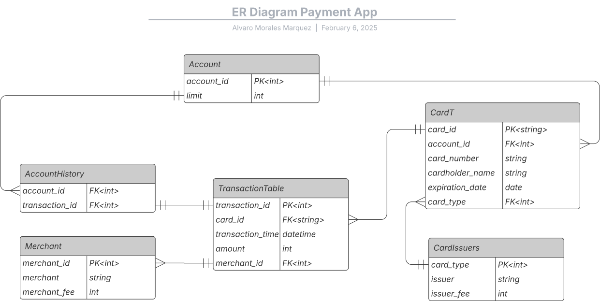

Merchants and Card Issuers have been added to the model. These entities are relatively small and fixed, so they are loaded into RAM to improve response times and ensure fast access during transaction processing.

Two types of data have been introduced for ease of use and testing:

Initial Data:

- This includes predefined merchants and card issuers, based on the examples given in the project specifications.
- These entities are loaded at the start of the application to avoid the need for manual data entry.

Dummy Data:

- Fake data is populated automatically to allow the program to function without the need for manually adding information.
- This ensures the program can be tested and used even when real data is not available or required.

These adaptations help in improving the overall functionality and testing experience of the application.

## Code Organization

From the beginning, the main goal was to create a **modular** structure that minimizes dependencies between the different blocks of the system. This approach aims to:

- **Facilitate scalability** : By having independent modules, new features or modifications can be added without affecting other parts of the system.
- **Improve maintainability** : Each module can be tested, debugged, and optimized in isolation.
- **Promote code reuse** : Common functionalities can be reused across different parts of the system without duplication.

Certain operations, such as **update** and **delete** , have not been implemented yet. These operations are not required for the current scope of the application, but the system is **not closed** to their addition in the future should the need arise.

### Database

The database is organized into three main folders:

- **DBConnector**: This folder provides a **Facade** to encapsulate all interactions with the database engine. It simplifies the user's interaction with the database by offering a high-level interface.
- **ORM**: This folder provides an **Object-Relational Mapper (ORM)** to facilitate managing database operations. The **DBConnector** uses the **ORM** as arguments to perform database operations, abstracting the underlying details.
- **Data**: This folder includes the **initial data** and **utility** functions used to populate and manage data in the database.

#### UML Diagram of DBConnector & ORM

A non-detailed UML diagram that illustrates the relationship between the DBConnector and ORM is shown below:

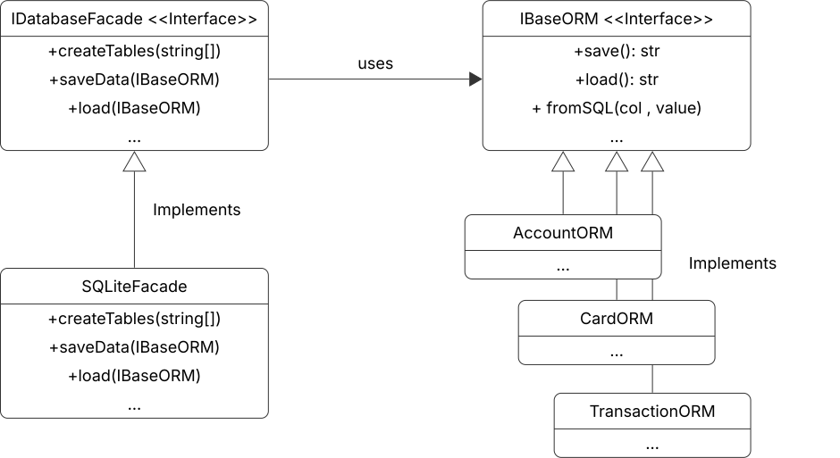

### UI

The application features a Command-Line Interface (CLI) that allows communication with the user. It validates and processes the input requests, ensuring the data is correct and secure (e.g., preventing SQL injection). The system is organized into the following four main folders:

1. **CommandLineParser**:
   - This folder handles the main process of the CLI. It stores and manages the different available options and their associated commands.
   - It acts as the entry point, interpreting user input and directing it to the appropriate logic.
2. **DataParser**:
   - This folder is responsible for parsing various data types such as CARD numbers, dates, and other input types.
   - It ensures that the data conforms to the expected format before being processed.
3. **InputValidator**:
   - This folder includes validators for text strings, ensuring that the user input is correctly formatted and secure.
   - It checks for issues like incorrect formats, empty fields, or potential security risks (e.g., SQL injection).
4. **Commands**:
   - This folder contains the five main operations of the CLI, each following the Command Pattern.
   - These operations represent the core functionality of the application, such as processing payments and showing transaction history.
   - Commands depend on **services** to ensure independence from database logic. This allows the commands to focus solely on handling user input and processing business logic, while delegating database-related operations to the service layer. This structure promotes flexibility and separation of concerns, making it easier to modify or extend the system in the future.

### Service

The **Service layer** serves as the bridge between the **UI** and the **database**. It is responsible for managing the business logic and ensuring that the database operations are abstracted away from the user interface. The key responsibilities of the Service layer are:

- **Data Handling:** It returns and receives data in basic, user-friendly formats (never exposing the ORM or database connectors to the UI layer).
- **Separation of Concerns**: By isolating database interactions from the UI, the Service layer ensures that the UI remains independent of database-specific logic. This promotes flexibility and maintainability.
- **Dependency Injection**: The Service layer uses dependency injection to allow the UI to interact with database logic in a decoupled way. This enables the application to be easily extended or modified without tightly coupling the UI with the database operations.

## Use Example

The initial screen looks like:
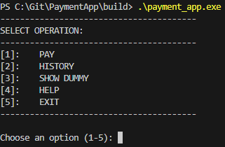

And some operations:
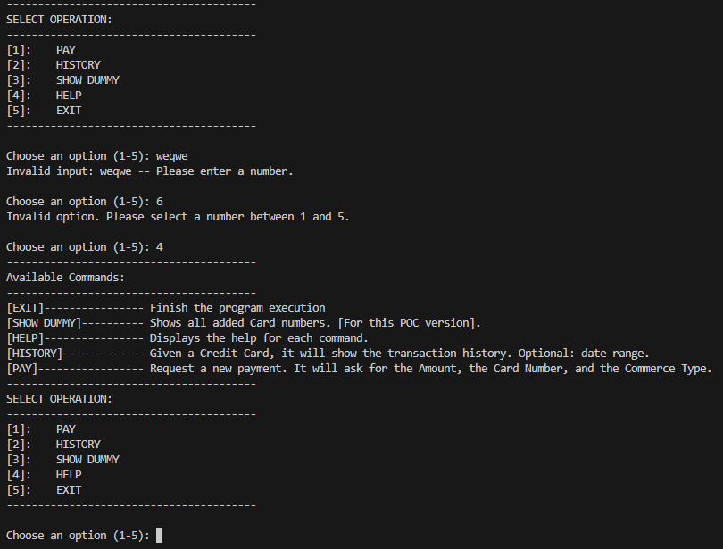
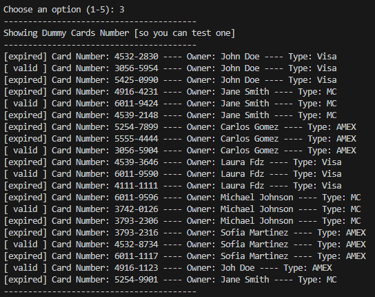

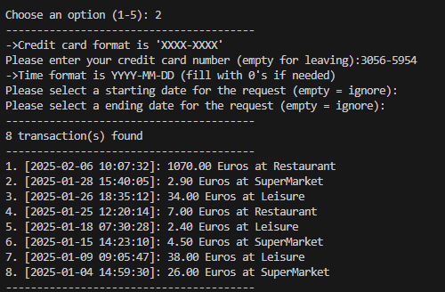
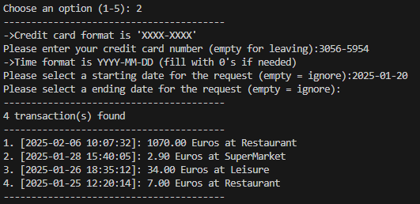
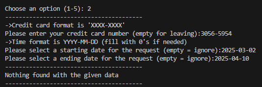

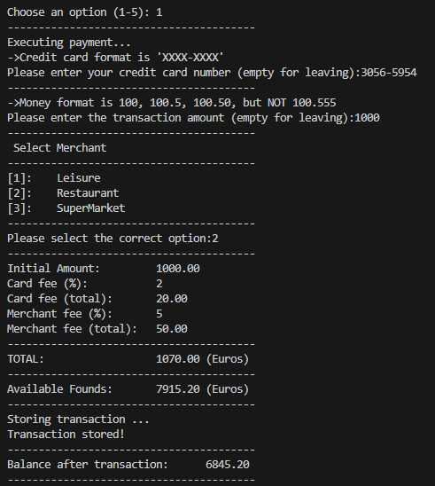
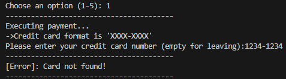
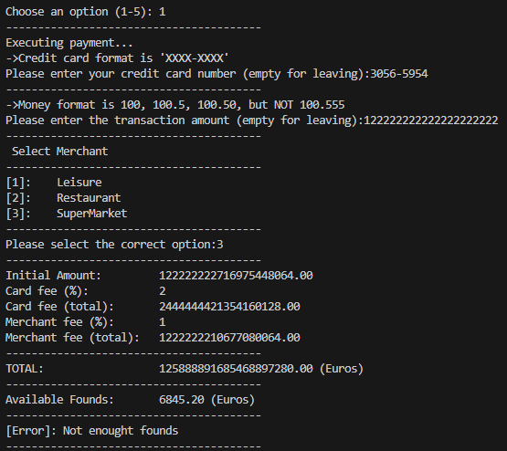
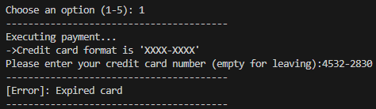

## Compile (Windows with MSYS2)

```bash
mkdir build
cd build
cmake -G "MinGW Makefiles" ..
mingw32-make
.\payment_app.exe
```

## Compile (standard)

```bash
mkdir build
cd build
cmake ..
make
./payment_app.exe
```
